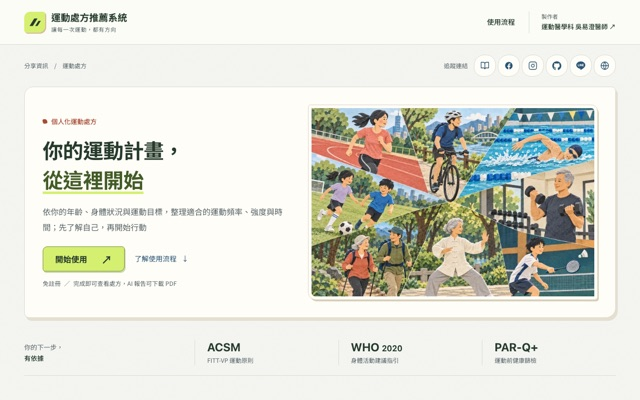
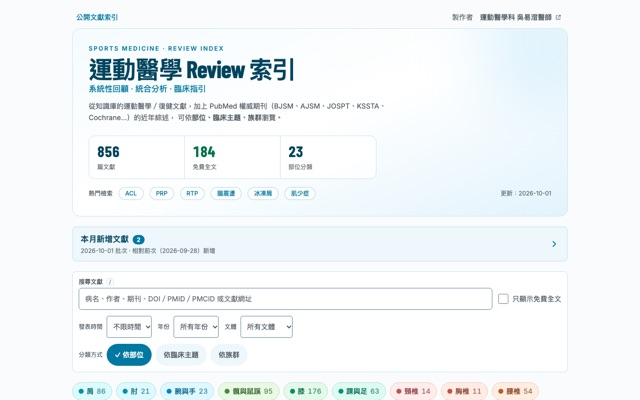
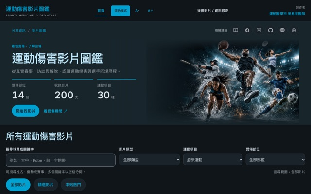
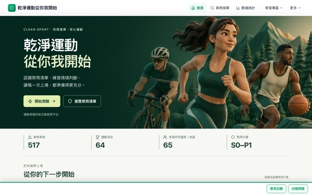

[中文](https://github.com/keanu77)　|　**English**

**Attending Physician, Sports Medicine**　·　Landseed International Clinic, Taipei

Ultrasound-guided injections (PRP / prolotherapy)　·　Sports injuries & return to play　·　Taiwan national team physician

I turn the questions patients ask most into readable health education and interactive tools.

> Most tools below are in Traditional Chinese.

---

## Live Tools

Sports health education, research tools, and imaging courses. Click **Open** to use them; source availability varies by project.

<table>
<tr>
<td width="50%" valign="top">

 <b><a href="https://exerciseprescription.sportsmedicine.tw/">AI Exercise Prescription</a></b> 
Personalized prescriptions by age, fitness, and health status, based on ACSM FITT-VP and WHO guidelines 
<a href="https://exerciseprescription.sportsmedicine.tw/">Open ↗</a>　·　<a href="https://github.com/keanu77/exercise-prescription-recommendation">Source</a>
</td>
<td width="50%" valign="top">

 <b><a href="https://review.sportsmedicine.tw/">Sports Medicine Review Index</a></b> 
Systematic reviews, meta-analyses, and guidelines, browsable by body region, topic, and population 
<a href="https://review.sportsmedicine.tw/">Open ↗</a>　·　<a href="https://github.com/keanu77/review.sportsmedicine">Source</a>
</td>
</tr>
<tr>
<td width="50%" valign="top">

 <b><a href="https://injury.sportsmedicine.tw/">Sports Injury Video Atlas</a></b> 
Real injury videos by body region, sport, and scenario, with mechanism notes and return-to-play records 
<a href="https://injury.sportsmedicine.tw/">Open ↗</a>　·　<a href="https://github.com/keanu77/sports-injury-atlas-starter">Public starter (MIT)</a>
</td>
<td width="50%" valign="top">

 <b><a href="https://antidopingplatform.sportsmedicine.tw/">Anti-Doping Education Platform</a></b> 
Search and compare doping sanction cases, with yearly trends and anti-doping quizzes 
<a href="https://antidopingplatform.sportsmedicine.tw/">Open ↗</a>　·　<a href="https://github.com/keanu77/antidopingplatform">Source</a>
</td>
</tr>
</table>

### More Tools

| Project | What it does | Links |
|------|--------| :----: |
| **Taiwan Exercise Map** | Open-data visualization of the national Sports City Survey: physical activity status, trends, and rankings across Taiwan's 22 counties and cities | [Open](https://twexercisemap.sportsmedicine.tw/) [repo](https://github.com/keanu77/twexercisemap) |
| **AthleteType** | A 28-question sports personality quiz with tailored sport suggestions, training styles, and a coach communication guide | [Open](https://athletetype.sportsmedicine.tw/) [repo](https://github.com/keanu77/athletetype) |
| **Marathon Finisher** | A 2D side-scrolling health education game: manage stamina, pacing, and injury risk while avoiding illness and overtraining | [Open](https://marathongame.sportsmedicine.tw/) [repo](https://github.com/keanu77/marathongame) |
| **Recovery Maze** | A recovery education maze game: collect sleep, nutrition, and hydration while escaping six risk chasers to reach the dawn exit | [Open](https://recoverymaze.sportsmedicine.tw/) [repo](https://github.com/keanu77/recoverymaze) |

### Sports Medicine Imaging Courses

Pick a body region from the hub, then practice reading X-ray, ultrasound, and MRI. Videos come with sources and teaching notes, and you can suggest videos or papers, or report corrections, from the site.

| Project | Description | Links |
|------|------| :----: |
| **Sports Medicine Imaging Hub** | Seven courses (shoulder, wrist & hand, hip, knee, ankle & foot, cervical and lumbar spine) with learning paths, video sources, and introductions to societies and experts | [Open](https://imaging-course-hub.sportsmedicine.tw/) [repo](https://github.com/keanu77/imaging-course-hub) |
| **Shoulder Imaging Course** | Structured X-ray, ultrasound, and MRI learning paths with section notes, scanning tips, and advanced reading practice on the rotator cuff, labrum, and shoulder instability | [Open](https://shoulder-imaging.sportsmedicine.tw/) [repo](https://github.com/keanu77/shoulder-imaging-course) |
| **Knee Imaging Course** | X-ray, ultrasound, and MRI through videos, section notes, knowledge checks, and advanced practice on knee anatomy, common pathology, and reporting essentials | [Open](https://knee-imaging.sportsmedicine.tw/) [repo](https://github.com/keanu77/knee-imaging-course) |

### Research & AI Tools

| Project | What it does | Links |
|------|--------| :----: |
| **Meta-Analysis Calculator** | Effect size conversion (Cohen's d / r / OR), confidence intervals, sample size and power estimation, with PDF reports | [Open](https://metacalc.sportsmedicine.tw/) [repo](https://github.com/keanu77/Meta-Analysis-Calculator) |
| **Reverse-Engineer Searcher** | Derives MeSH terms from gold-standard PMIDs and builds sensitive / balanced / precise PubMed search strategies | [Open](https://rev-searcher.sportsmedicine.tw/) [repo](https://github.com/keanu77/reverse-engineer-searcher) |
| **AI Skill Directory** | A searchable, categorized guide to Agent Skills | [Open](https://aiskills.sportsmedicine.tw/) [repo](https://github.com/keanu77/AIskillsintro) |

---

## About Me

Sports medicine, physical medicine & rehabilitation, and pain medicine. My clinic focuses on sports injuries and shoulder, neck, knee, and ankle pain, mainly with ultrasound-guided injections and exercise prescriptions. Outside the clinic, I use TypeScript and AI coding agents to bring sports medicine knowledge to the web.

| Area | Topics |
|---|---|
| **Clinical** | Ultrasound-guided injections, PRP / prolotherapy, shoulder pain, knee osteoarthritis, foot & ankle injuries, running injuries, return-to-play assessment |
| **Health education** | Long-form articles, FAQ / AEO structured data, exercise demo pages, and literature indexes, all self-checked against Article 85 of Taiwan's Medical Care Act |
| **Education tools** | Exercise prescription generator, anti-doping platform, personality quiz, health education games, open-data visualization |
| **AI workflow** | Cross-auditing with multiple coding agents, custom MCP servers, literature verification and RAG pipelines, local model inference, medical content compliance checks |

- [sportsmedicine.tw/en](https://sportsmedicine.tw/en/)　Health education articles, topics, exercise demos, and tools
- [sportsmedicine.tw/lab](https://sportsmedicine.tw/lab)　Vibe-coding portfolio; source availability varies by project
- [blog.sportsmedicine.tw](https://blog.sportsmedicine.tw/)　My long-running blog since 2017 (Chinese)
- [review.sportsmedicine.tw](https://review.sportsmedicine.tw/)　Index of sports medicine systematic reviews and guidelines

---

## Tech Stack & Tools

<b>Tech stack &amp; tools (click to expand)</b>

### Core

### Web

### Data & Visualization

&nbsp;

### Deployment & Ops

&nbsp;

### AI Collaboration

### Local Inference & Knowledge Base

**How I use them**: multiple coding agents each take a non-overlapping dimension, then cross-check each other's findings.
Sensitive or highly repetitive analysis runs on local models, so the data stays on my machine. Literature and health education content
feed a self-hosted RAG, exposed to agents through MCP servers for fact-checking. All medical content passes Article 85 of the Medical Care Act and a clinical terminology check before publishing.

---

## GitHub Statistics

<picture>
  <source media="(prefers-color-scheme: dark)" srcset="https://github-readme-stats-fast.vercel.app/api?username=keanu77&show_icons=true&count_private=true&include_all_commits=true&hide_border=true&bg_color=0d1117&title_color=38bdf8&icon_color=34d399&text_color=c9d1d9&ring_color=fb923c&border_radius=10" />
  
</picture>
<picture>
  <source media="(prefers-color-scheme: dark)" srcset="https://github-readme-stats-fast.vercel.app/api/top-langs/?username=keanu77&layout=compact&langs_count=8&hide_border=true&bg_color=0d1117&title_color=38bdf8&text_color=c9d1d9&border_radius=10" />
  
</picture>

<picture>
  <source media="(prefers-color-scheme: dark)" srcset="https://streak-stats.demolab.com?user=keanu77&theme=default&hide_border=true&background=0d1117&stroke=0ea5e9&ring=fb923c&fire=f87171&currStreakLabel=fb923c&currStreakNum=e6edf3&sideNums=e6edf3&sideLabels=c9d1d9&dates=8b949e&border_radius=10" />
  
</picture>

---

## Contact

---

These tools and materials are for health education only and cannot replace a physician's examination or imaging such as ultrasound or MRI. If symptoms persist or worsen, please see a doctor.

